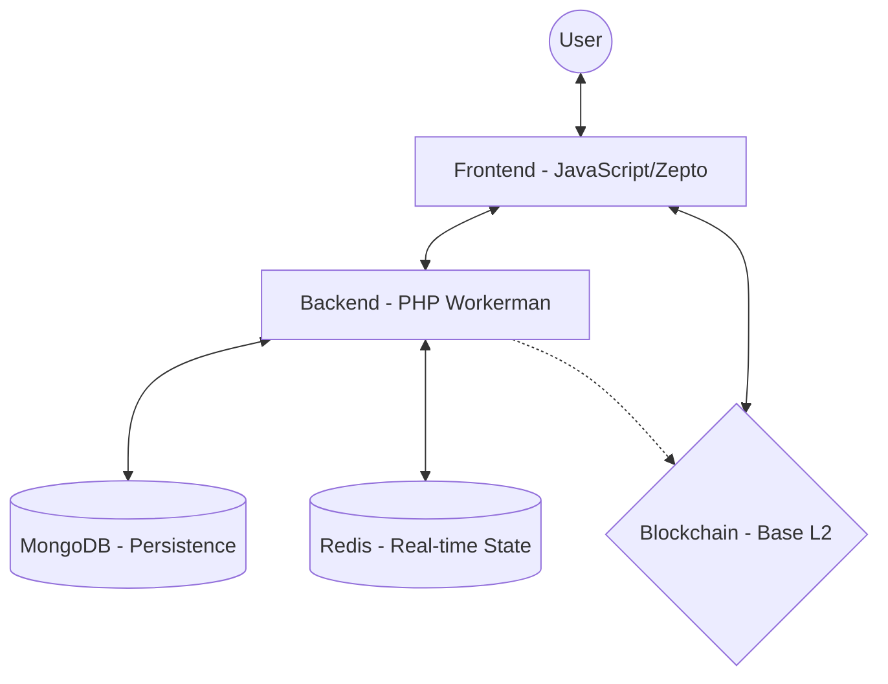

# Piece One

> **Drop emojis, not bombs. A shared canvas for on-chain memories.**

[](https://opensource.org/licenses/Apache-2.0)
[](https://github.com/ezshine/Piece.One/commits/main)

---

## 🌟 Introduction

### The Problem
Most online spaces are designed for speed, visibility, and disappearance.
- Content is pushed into feeds, quickly consumed, and then replaced.
- There is no sense of place, memory, or persistence — only timelines.
- World maps are often used to divide, claim, or compete, rather than as shared spaces for expression and connection.

### What Piece One Solves
Piece One offers a different model. It turns the world map into a **shared canvas** where people can leave small, meaningful contributions that stay. 

Instead of competing for attention, users can:
- **Interact** with others through simple emoji-based actions.
- **Explore** and discover on-chain assets left by the community.
- **Permanently place** images, NFTs, or cultural artifacts in specific locations.

By anchoring interactions and assets to real places on-chain, Piece One restores presence, memory, and shared ownership to digital expression.

---

## 🏗 Architecture

Piece One is built with a focus on real-time persistence and scalability.



### Components
- **Frontend**: A high-performance canvas-based interface using standard JavaScript and Zepto.js, optimized for smooth map navigation.
- **Real-time Engine**: Powered by **Workerman** (PHP), handling high-concurrency WebSocket connections for player movement and emoji interactions.
- **State Management**: 
    - **Redis**: Stores transient data like active player positions and temporary proximity effects.
    - **MongoDB**: Stores persistent data including land ownership, placed assets, and history.
- **Blockchain Integration**: Core ownership (Placement, NFTs) is anchored on-chain, while expressive interactions (reactions) are handled off-chain to maintain a fast, playful experience.

---

## 🛠 Tech Stack

- **Backend**: PHP 8.2, [Workerman](http://www.workerman.net/) (High-performance Socket)
- **Database**: MongoDB, Redis
- **Infrastructure**: Nginx, PHP-FPM, Docker
- **Frontend**: Vanilla JS, Zepto.js, GSAP (Animations), Tone.js (Audio)
- **Blockchain**: EVM Compatible (Base - Ethereum L2)

---

## 🚀 Build & Installation

### Prerequisites
- Docker & Docker Compose
- Environment Variables Setup

### Quick Start
1. **Clone the repository**
   ```bash
   git clone https://github.com/ezshine/Piece.One.git
   cd Piece.One
   ```

2. **Configure Environment**
   ```bash
   cp .env.example .env
   # Edit .env and fill in your RPC nodes and API keys
   ```

3. **Launch with Docker**
   ```bash
   docker-compose up -d --build
   ```

4. **Access the Application**
   Open `http://127.0.0.1:3000` in your browser.

---

## 💡 Challenges & Solutions

### Balancing Permanence with Playfulness
Emoji interactions are lightweight, but on-chain data is permanent. We solved this by **separating core state** (placement, ownership) from **expressive interactions** (reactions, proximity effects). This keeps the experience fast while preserving meaning where it matters.

### Mapping a Continuous World to a Discrete System
Translating a real-world map into an intuitive grid was complex. We experimented with different resolutions and snapping rules, eventually choosing a grid that balances **discoverability, fair access, and long-term scalability**.

### Building for Clarity in a Demo Setting
For the MVP/Hackathon, we focused on the core loop: **Placing a piece → Seeing it persist → Discovering what others left behind.** This allows judges to immediately understand the core idea within seconds.

---

## 🎥 Demo & Links

- **Demo Video**: [\[YouTube\]](https://youtu.be/LOuWJJqyJ5w?si=v49nizhBxQHvU3gb)

---

## 📄 License

This project is licensed under the **Apache License 2.0** - see the [LICENSE](LICENSE) file for details.
